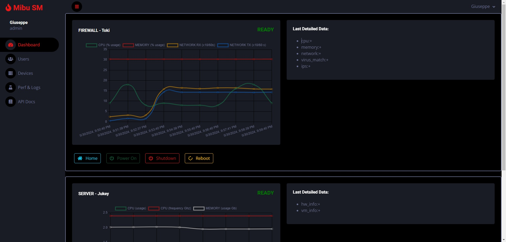
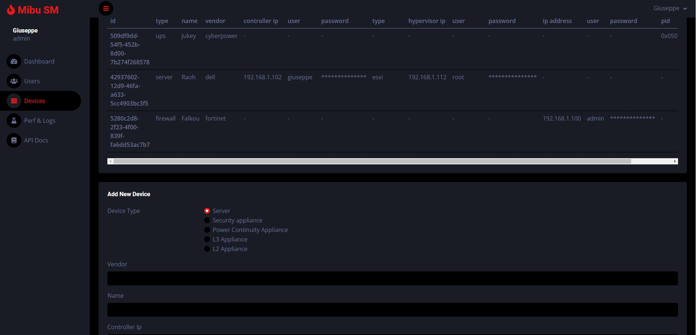
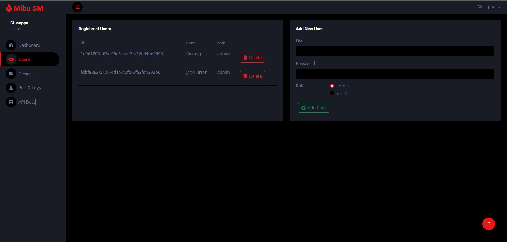
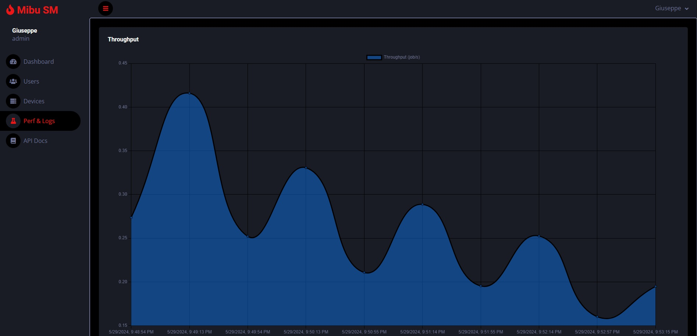
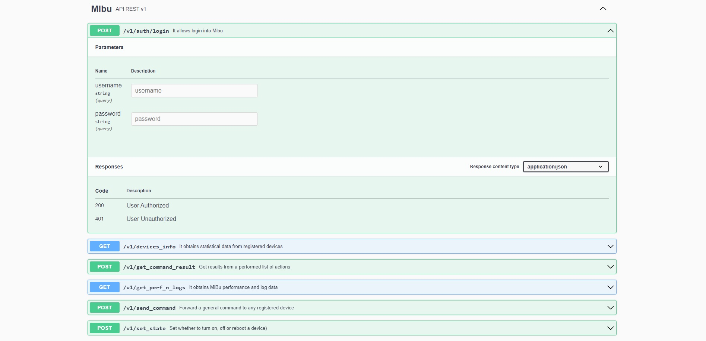

# Mibu SM

**Mibu** is a network device control and monitoring software designed to provide a comprehensive overview of your network infrastructure. The software is designed to be easily extensible to support additional devices.


## Features

- **Backend**: Written in Python, utilizing Flask as framework.
- **Frontend**: Built with HTML (using Jinja for templating) and JavaScript.
- **Database**: Configured by default to use MongoDB as the primary database.
- **Message Broker**: Configured by default to use Redis as the primary message broker.
- **Agentless**: No need to install agents on the devices being monitored.
- **Stateless**: Capable of determining the current state of devices (reachable, logged-in/off) at any given time.
- **Design Patterns**:
  - **Decorator**: Used in `controller.py`, `hypervisor.py`, `firewall.py`, `device_factory.py`, `device.py`, `internal_db.py`, `message_broker.py`, `power_continuity_observer.py`, `reachability.py`, `ups.py`, and `worker.py` (Structural Pattern).
  - **Singleton**: Used in `engine.py`, `service.py`, `config_loader.py` (Creational Pattern).
  - **Abstract Factory**: Used in `device_factory.py` (Creational Pattern).
  - **Observer**: Used in `power_continuity_observer.py` (Behavioral Pattern).
- **Architecture**:
  - **MVC**: Implemented in the web server with `controller.py` and `models.py` inside the `flaskr` folder, and HTML files inside `flaskr/templates`.
  - **Pub/Sub**: General software architecture.
  - **SOLID Principles**: The software design adheres to SOLID principles.
  

## Getting Started via Docker

The easiest way to get started with MiBuSM is by using Docker. 

### Prerequisites

- Docker
- Docker Compose

### Installation and Running 

1. Clone the repository:

    ```bash
    git clone https://github.com/gmichetti/mibusm.git
    ```

2. Run the following command:
    ```bash
    docker-compose up --build -d
    ```

    This command will build the Docker image and start the containers in detached mode.


## Getting Started for Linux/Windows

To get started on Linux or Windows without Docker, follow these steps:

### Prerequisites

- Python >= 3.8.0
- MongoDB >= 4.4.8
- Redis >= 6.0.16

### Installation

1. Clone the repository:

    ```bash
    git clone https://github.com/gmichetti/mibusm.git
    ```

2. Create a virtual environment and activate it:
    
    (*windows*)
    ```bash
    python -m venv venv
    venv\Scripts\activate
    ```
    (*linux*)
    ```bash
    python -m venv venv
    source venv/bin/activate
    ```

3. Install the required Python packages:

    ```bash
    pip install -r requirements.txt
    ```

4. Configure MongoDB and Redis as per your setup requirements.

5. Create the folder (and set up the correct permissions) to put the logs in (look at following paragraph)


### Configuration

1. Modify the `config.yaml` file to set up the engine configurations. If no file config file is provided, will be used the default values (look at `config_loader.py`)

2. Modify the `config.js` file to set up the Flask server configuration. If no config is provided, will be used the default values


### Run the Application

1. Launch the necessary engine scripts:

    (*windows*)
    ```bash
    engine/python engine.py
    engine/python auto_feeder.py
    ```
    (*linux*)
    ```bash
    engine\python engine.py
    engine\python auto_feeder.py
    ```

2. Run the Flask server from the main folder:

    ```bash
    flask --app flaskr.server run
    ```
    or, if the Flask servers runs on an external machine:
    ```bash
    flask --app flaskr.server run --host=0.0.0.0
    ```

    (It is recommended *not* to use the internal Flask server but to use for example, nginx/gunicorn combination)

3. It is recommended to create a scheduler/crontab to remove the zip files containing the old archived logs. For example:

    (*windows*)
    ```bash
    del /Q "C:\var\log\mibu\*.zip"
    ```
    add the batch script in the scheduler (taskschd.msc)

    (*linux*)
    ```bash
    sudo crontab -e
    0 */72 * * * find /var/log/mibu -type f -name "*.zip" -delete
    ```

**Note for Linux Users**

If you don't have sufficient permissions to access the USB UPS device, follow these steps:

1. create a cp.rules file in the folder `etc/udev.rules.d` like this:

```
SUBSYSTEMS=="usb", ATTRS{idVendor}=="0764", ATTRS{idProduct}=="0601", GROUP="users", MODE="0666" 
```

and replace the values ​​'idVendor' and 'idProduct' you can get via the `lsusb` command

If if it still doesn't work:

2. Create a one-line file in `/etc/modules-load.d/00-my-usbhid.conf` with the following content:

```
usbhid
```

It should not be necessary to do this on modern systems because modules are automatically loaded, but sometimes it is still necessary to force loading of a module.

3. If all else fails, try adding the following kernel boot parameter:

```
usbhid.quirks=0x0463:0xffff:0x08

```

## Usage

Once the application is running, you can access the web interface through your browser at `http://localhost:8000` (or the address where the server is running). The interface provides various functionalities to monitor and control your network devices.
The default credentials are: 

- user: "JackBurton"
- password: "Ch@ngeMe!"


The REST APIs exposed by the server are documented via the related Swagger within the GUI itself


## Extending Mibu

Mibu is designed to be easily extensible. To add support for new devices, you need to:

1. Create a new module in the `engine` directory.
2. Update the files `device.py`, `device_factory.py` and `engine.py`
2. Implement the necessary communication protocols and monitoring features for the new device.

## Screenshots


*Screenshot of the Mibu dashboard.*


*Screenshot of the device monitored.*


*Screenshot of the users registered.*


*Screenshot of the performance page.*


*Screenshot of the logs page.*


*Screenshot API rest swagger page*


## Version

**[1.0.5] - 08-12-2024**


## Contributing

We welcome contributions to Mibu! If you have any suggestions, bug reports, or improvements, please open an issue or submit a pull request.


## License

MiBu is free software; you can redistribute it and/or modify it
under the terms of the GNU Lesser General Public License as published by
the Free Software Foundation, either version 3 of the License, or (at
your option) any later version.

MiBu is distributed in the hope that it will be useful, but WITHOUT
ANY WARRANTY; without even the implied warranty of MERCHANTABILITY or
FITNESS FOR A PARTICULAR PURPOSE. See the GNU Lesser General Public
License for more details.

You should have received a copy of the GNU Lesser General Public License
along with this program.  If not, see <http://www.gnu.org/licenses/>.


## Contact

For any inquiries or support, please contact [gius.michetti@gmail.com](mailto:gius.michetti@gmail.com).
